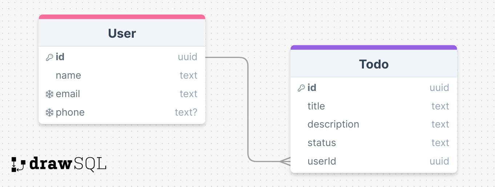

# Fancy-Todo-API-Prisma

Sebuah API sederhana untuk mengelola daftar tugas (todo) dengan fitur CRUD (Create, Read, Update, Delete).

## Deskripsi

Fancy Todo API adalah sebuah aplikasi API yang dibangun menggunakan Node.js, Express.js, dan Prisma sebagai ORM untuk database MySQL. API ini menyediakan endpoint untuk mengelola daftar tugas (todo) dan pengguna yang terdaftar. Setiap pengguna dapat membuat, membaca, memperbarui, dan menghapus daftar tugas mereka sendiri.

## Teknologi Yang Digunakan

- Node.js
- Express.js
- Prisma
- MySQL

## Database Schema



Gambar di atas menunjukkan skema database yang digunakan dalam proyek ini.

## Instalasi

1.  Kloning repositori ini ke dalam direktori lokal Anda.

```bash
git clone https://github.com/manzadhit/Fancy-Todo-API-Prisma.git
```

2.  Jalankan perintah `npm install` untuk menginstal semua dependensi yang dibutuhkan.
3.  Salin file `.env.example` dan ubah namanya menjadi `.env`.
4.  Edit file `.env` dan isi dengan nilai yang sesuai untuk setiap variabel lingkungan yang diperlukan. Pastikan untuk mengisi nilai `DATABASE_URL` dengan URL koneksi database MySQL yang benar.
5.  Jalankan perintah `npx prisma db push` untuk menerapkan skema database ke MySQL.
6.  Jalankan perintah `npm run dev` untuk menjalankan server API.

## Penggunaan

### Endpoint

- [User](#user)

  - [Create User](#create-user)
  - [Get All Users](#get-all-users)
  - [Get User By ID](#get-user-by-id)
  - [Update User](#update-user)
  - [Delete User](#delete-user)

- [Todo](#todo)
  - [Create Todo](#create-todo)
  - [Get All Todos](#get-all-todos)
  - [Get Todo By ID](#get-todo-by-id)
  - [Update Todo](#update-todo)
  - [Delete Todo](#delete-todo)

### User

#### Create User

Membuat pengguna baru dengan memberikan nama pengguna, alamat email, dan nomor telepon.

**URL**

```bash
POST /user
```

**Body Request**

```json
{
  "name": "John Doe",
  "email": "john.doe@example.com",
  "phone": "123456789"
}
```

**Response Success**

```json
{
  "status": 201,
  "message": "Successfully created user",
  "data": {
    "id": "8e3447de-8859-433d-98a6-b3c55109fb9f",
    "name": "John Doe",
    "email": "john.doe@example.com",
    "phone": "123456789",
    "createdAt": "2024-05-08T00:34:04.437Z",
    "updatedAt": "2024-05-08T00:34:04.437Z"
  }
}
```

#### Get All Users

Mendapatkan daftar semua pengguna yang terdaftar.

**URL**

```bash
GET /user
```

**Response Success**

```json
{
  "status": 200,
  "message": "Successfully retrieved users",
  "data": [
    {
      "id": "8e3447de-8859-433d-98a6-b3c55109fb9f",
      "name": "John Doe",
      "email": "john.doe@example.com",
      "phone": "123456789",
      "createdAt": "2024-05-08T00:34:04.437Z",
      "updatedAt": "2024-05-08T00:34:04.437Z"
    },
    {
      "id": "f9b1e8d7-a2c5-4b6f-b7d5-f6a3c9b9b2c1",
      "name": "Jane Smith",
      "email": "jane.smith@example.com",
      "phone": null,
      "createdAt": "2024-05-08T01:15:22.891Z",
      "updatedAt": "2024-05-08T01:15:22.891Z"
    }
  ]
}
```

#### Get User By ID

Mendapatkan detail pengguna berdasarkan ID pengguna.

**URL**

```bash
GET /user/:userId
```

**Response Success**

```json
{
  "status": 200,
  "message": "Successfully retrieved user",
  "data": {
    "id": "8e3447de-8859-433d-98a6-b3c55109fb9f",
    "name": "John Doe",
    "email": "john.doe@example.com",
    "phone": "123456789",
    "createdAt": "2024-05-08T00:34:04.437Z",
    "updatedAt": "2024-05-08T00:34:04.437Z",
    "todos": [
      {
        "id": "c1bfc9e4-ee98-4d3e-a27d-3ac04035a15b",
        "title": "Buat presentasi",
        "description": "Persiapan presentasi untuk rapat mingguan",
        "status": "Todo",
        "createdAt": "2024-05-08T12:00:00.000Z",
        "updatedAt": "2024-05-08T12:00:00.000Z"
      },
      {
        "id": "29bc8689-0e5c-482f-9168-ef07f81e0f53",
        "title": "Pesan makan malam",
        "description": "Pesan makan malam untuk acara ulang tahun",
        "status": "Todo",
        "createdAt": "2024-05-08T13:00:00.000Z",
        "updatedAt": "2024-05-08T13:00:00.000Z"
      }
    ]
  }
}
```

#### Update User

Memperbarui data pengguna berdasarkan ID pengguna.

**URL**

```bash
PATCH /user/:userId
```

**Body Request**

```json
{
  "name": "John D. Doe",
  "email": "johndoe123@gmail.com",
  "phone": "987654321"
}
```

**Response Success**

```json
{
  "status": 200,
  "message": "Successfully updated user",
  "data": {
    "id": "8e3447de-8859-433d-98a6-b3c55109fb9f",
    "name": "John D. Doe",
    "email": "johndoe123@gmail.com",
    "phone": "987654321",
    "createdAt": "2024-05-08T00:34:04.437Z",
    "updatedAt": "2024-05-08T02:20:15.629Z"
  }
}
```

#### Delete User

Menghapus pengguna berdasarkan ID pengguna.

**URL**

```bash
DELETE /user/:userId
```

**Response Success**

```json
{
  "status": 200,
  "message": "Successfully deleted user"
}
```

### Todo

#### Create Todo

Membuat tugas baru dengan memberikan judul, deskripsi, dan ID pengguna.

**URL**

```bash
POST /todo
```

**Body Request**

```json
{
  "title": "Buat presentasi",
  "description": "Persiapan presentasi untuk rapat mingguan",
  "status": "Panding",
  "userId": "8e3447de-8859-433d-98a6-b3c55109fb9f"
}
```

**Response Success**

```json
{
  "status": 201,
  "message": "Successfully created todo",
  "data": {
    "id": "c1bfc9e4-ee98-4d3e-a27d-3ac04035a15b",
    "title": "Buat presentasi",
    "description": "Persiapan presentasi untuk rapat mingguan",
    "status": "Panding",
    "userId": "8e3447de-8859-433d-98a6-b3c55109fb9f",
    "createdAt": "2024-05-08T12:00:00.000Z",
    "updatedAt": "2024-05-08T12:00:00.000Z"
  }
}
```

#### Get All Todos

Mendapatkan daftar semua tugas yang terdaftar.

**URL**

```bash
GET /todo
```

**Response Success**

```json
{
  "status": 200,
  "message": "Successfully retrieved todos",
  "data": [
    {
      "id": "c1bfc9e4-ee98-4d3e-a27d-3ac04035a15b",
      "title": "Buat presentasi",
      "description": "Persiapan presentasi untuk rapat mingguan",
      "status": "Todo",
      "userId": "8e3447de-8859-433d-98a6-b3c55109fb9f",
      "createdAt": "2024-05-08T12:00:00.000Z",
      "updatedAt": "2024-05-08T12:00:00.000Z"
    },
    {
      "id": "29bc8689-0e5c-482f-9168-ef07f81e0f53",
      "title": "Pesan makan malam",
      "description": "Pesan makan malam untuk acara ulang tahun",
      "status": "Todo",
      "userId": "f9b1e8d7-a2c5-4b6f-b7d5-f6a3c9b9b2c1",
      "createdAt": "2024-05-08T13:00:00.000Z",
      "updatedAt": "2024-05-08T13:00:00.000Z"
    }
  ]
}
```

#### Get Todo By ID

Mendapatkan detail tugas berdasarkan ID tugas.

**URL**

```bash
GET /todo/:todoId
```

**Response Success**

```json
{
  "status": 200,
  "message": "Successfully retrieved todo",
  "data": {
    "id": "c1bfc9e4-ee98-4d3e-a27d-3ac04035a15b",
    "title": "Buat presentasi",
    "description": "Persiapan presentasi untuk rapat mingguan",
    "status": "Todo",
    "userId": "8e3447de-8859-433d-98a6-b3c55109fb9f",
    "createdAt": "2024-05-08T12:00:00.000Z",
    "updatedAt": "2024-05-08T12:00:00.000Z"
  }
}
```

#### Update Todo

Memperbarui data tugas berdasarkan ID tugas.

**URL**

```bash
PATCH /todo/:todoId
```

**Body Request**

```json
{
  "title": "Buat presentasi (Update)",
  "description": "Persiapan presentasi untuk rapat mingguan (Update)"
}
```

**Response Success**

```json
{
  "status": 200,
  "message": "Successfully updated todo",
  "data": {
    "id": "c1bfc9e4-ee98-4d3e-a27d-3ac04035a15b",
    "title": "Buat presentasi (Update)",
    "description": "Persiapan presentasi untuk rapat mingguan (Update)",
    "status": "Todo",
    "userId": "8e3447de-8859-433d-98a6-b3c55109fb9f",
    "createdAt": "2024-05-08T12:00:00.000Z",
    "updatedAt": "2024-05-08T14:00:00.000Z"
  }
}
```

#### Delete Todo

Menghapus tugas berdasarkan ID tugas.

**URL**

```bash
DELETE /todo/:todoId
```

**Response Success**

```json
{
  "status": 200,
  "message": "Successfully deleted todo"
}
```
